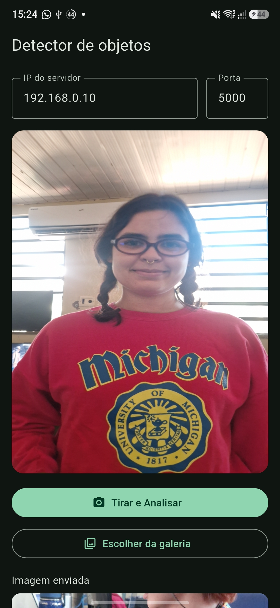
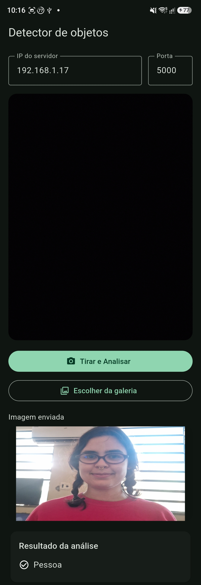
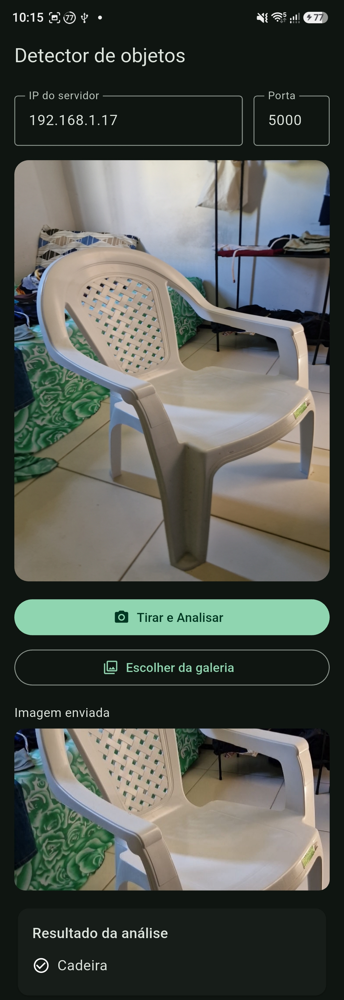

# Detector de objetos — Android + Servidor Python (Sockets TCP + YOLO)

> **Trabalho II — Sistemas Distribuídos (UFPI/CSHNB — 2026.2)**

Aplicativo Android em Flutter captura uma foto e envia o JPEG por **socket TCP** a um
servidor Python com **YOLOv11**, que responde os objetos detectados. O resultado é
exibido na tela do próprio aparelho que enviou a foto.

```
┌─────────────────────┐   TCP 5000    ┌──────────────────────────┐
│  Android (Flutter)  │ ────────────▶ │  Servidor Python         │
│  câmera → JPEG      │ 4B tam + JPEG │  (Docker) com YOLOv11n   │
│  mostra o resultado │ ◀──────────── │  JSON {detected, labels, │
└─────────────────────┘ 4B tam + JSON  │         message}         │
                                      └──────────────────────────┘
```

**Protocolo (framing):** como o TCP é um fluxo de bytes sem fronteiras de mensagem,
tanto o app quanto o servidor usam a mesma convenção — **4 bytes de tamanho
(big-endian) seguidos do payload**. No pedido o payload é o JPEG; na resposta é um
JSON UTF-8. Exemplo de resposta:

```json
{"detected": true, "labels": ["Pessoa", "Cadeira"], "message": "Pessoa detectada\nCadeira detectado"}
```

Padrão de commits: [Conventional Commits](https://www.conventionalcommits.org/en/v1.0.0/)

---

## Estrutura do repositório

```
app/                  Aplicativo Flutter (Android)
├── lib/src/
│   ├── config.dart               IP/porta padrão, limites de imagem e timeouts
│   ├── camera/image_prep.dart    Redimensiona (máx. 1280px) e comprime (JPEG 80)
│   ├── protocol/tcp_client.dart  Cliente TCP com o framing 4 bytes + payload
│   └── ui/                       Tela principal e cartão de resultado
└── android/                      Projeto Android (gerado pelo setup.ps1)

server/               Servidor Python (único serviço em container)
├── main.py          Socket TCP, uma thread por conexão (atende vários celulares)
├── protocol.py      recv/send com framing de 4 bytes
├── detector.py      YOLOv11n, confiança mínima 0.5, rótulos traduzidos p/ PT
├── config.py        HOST (bind), PORT e MODEL_NAME
├── received/        Fotos recebidas (salvas a cada análise; não sobem pro git)
└── Dockerfile

tests/                Scripts de teste ponta a ponta (sem dependências externas)
├── test_client.py       1 cliente: envia foto e valida o JSON de resposta
└── test_concurrent.py   N clientes simultâneos (threads), como vários celulares

docs/screenshots/     Capturas de tela do app (erro, resultados da detecção)
```

---

## Como rodar o servidor

### Opção A — Docker (recomendada)

Na raiz do projeto:

```bash
docker compose up -d --build
```

Acompanhe os logs e confirme que subiu:

```bash
docker logs -f objectdetectoryolo-server-1
# Deve aparecer: [INFO] Servidor ouvindo em 0.0.0.0:5000
```

### Opção B — Python nativo

```bash
cd server
python -m venv .venv
source .venv/bin/activate        # Windows: .venv\Scripts\activate
pip install -r requirements.txt
python main.py
```

> **Nota (Windows):** o `ultralytics` instala o OpenCV com GUI, que exige
> `opencv-python-headless` no Linux/container — o `Dockerfile` já troca isso
> automaticamente. No Windows nativo normalmente funciona sem ajuste.

### Configurar IP/porta do servidor (`server/config.py`)

```python
HOST = "0.0.0.0"   # escuta em todas as interfaces (mantenha assim)
PORT = 5000
MODEL_NAME = "yolo11n.pt"
```

`0.0.0.0` faz o servidor aceitar conexões vindas da rede Wi-Fi (celulares).
O IP que o **app** usa é o IPv4 do **PC** na rede — não é configurado aqui.

### Firewall

**Linux (firewalld):**

```bash
sudo firewall-cmd --add-port=5000/tcp --permanent
sudo firewall-cmd --reload
```

**Windows (PowerShell como administrador):**

```powershell
New-NetFirewallRule -DisplayName "Detector YOLO TCP 5000" -Direction Inbound -Protocol TCP -LocalPort 5000 -Action Allow
```

---

## Como rodar o app (Flutter)

### Pré-requisitos

- [Flutter SDK](https://docs.flutter.dev/get-started/install/windows) no PATH (`flutter doctor`)
- Android Studio com Android SDK (platform-tools + uma platform)
- Aparelho Android com Depuração USB **ou** emulador
- Servidor **ligado** antes de tocar em *Tirar e Analisar*

### Primeira vez (Windows, gera a pasta `android/`)

No PowerShell, na pasta `app/`:

```powershell
$env:Path = "$env:USERPROFILE\develop\flutter\bin;" + $env:Path
cd app
.\setup.ps1
flutter pub get
```

O `setup.ps1` cria o projeto Android (se faltar) e aplica permissões de câmera/
internet/galeria + TCP sem TLS (`usesCleartextTraffic`), exigido pelo enunciado.

### No aparelho

1. USB + Depuração USB (autorize o computador no telefone).
2. `flutter devices` deve listar o aparelho.
3. Na pasta `app/`: `flutter run` (atalhos: `r` hot reload, `R` hot restart, `q` sair).

Para instalar em vários aparelhos sem cabo, gere o APK e instale em cada um:

```bash
flutter build apk --debug
# app/build/app/outputs/flutter-apk/app-debug.apk
```

### Configurar IP/porta no app

Os campos ficam na **tela inicial** e são salvos no aparelho
(`SharedPreferences`) após a primeira análise.

| Cenário | IP a digitar no app | Porta |
| --- | --- | --- |
| Celular na mesma Wi-Fi do PC | IPv4 do PC — `ipconfig` (Windows) ou `ip addr` (Linux) | `5000` |
| Emulador Android | `10.0.2.2` (alias do PC hospedeiro) | `5000` |

Requisitos: celular e PC na **mesma Wi-Fi**, sem VPN, firewall liberado na porta 5000
e **servidor ligado antes** de *Tirar e Analisar*.

### Timeouts e erros de conexão (app)

Configurados em `app/lib/src/config.dart`: conexão **8s**, resposta **30s**.
A tela traduz cada falha em orientação:

| Mensagem no app | Causa provável |
| --- | --- |
| "Servidor não respondeu a tempo (timeout)" | Servidor desligado, IP errado ou firewall descartando pacotes |
| "Conexão recusada" | Nada ouvindo no IP/porta (servidor parado) |
| "Rede inacessível" | Celular em outra rede / VPN ativa |
| "Nada Detectado" | Comunicação OK — a foto simplesmente não tem objeto com confiança ≥ 0.5 |

---

## Como testar (ponta a ponta)

Os scripts em `tests/` usam **somente a biblioteca padrão** do Python e falam o
mesmo protocolo do app (4 bytes de tamanho + JPEG na ida, + JSON na volta).

### 1. Teste de um cliente

```bash
# Servidor local (Docker publíca na 127.0.0.1)
python3 tests/test_client.py docs/screenshots/02-resultado-pessoa-detectada.jpg

# Contra o IP da rede (simula um celular)
python3 tests/test_client.py foto.jpg --host 192.168.1.17 --port 5000
```

Saída esperada:

```
[ENVIADO] 137419 bytes para 192.168.1.17:5000
[RESPOSTA] {"detected": true, "labels": ["bus", "Pessoa"], ...}
[OK] Objetos detectados: bus, Pessoa
```

Código de saída `0` = sucesso (útil em CI/automação).

### 2. Teste de concorrência (vários celulares ao mesmo tempo)

```bash
python3 tests/test_concurrent.py foto.jpg --host 127.0.0.1 --clients 3
```

Dispara N clientes em threads simultâneas (como N aparelhos) e resume:

```
[TESTE] Disparando 3 clientes simultâneos contra 127.0.0.1:5000...
  Cliente 0: OK em 0.16s -> ['bus', 'Pessoa']
  Cliente 1: OK em 0.11s -> ['bus', 'Pessoa']
  Cliente 2: OK em 0.06s -> ['bus', 'Pessoa']
[RESUMO] 3/3 clientes atendidos em 0.17s no total
```

Falha se qualquer cliente não receber resposta válida dentro do timeout do app (30s).
O servidor atende cada conexão em uma **thread própria**; apenas a inferência do
YOLO é serializada internamente (não é thread-safe), então clientes simultâneos
podem enfileirar alguns segundos de detecção — dentro do timeout.

### 3. Verificação no servidor

Cada foto analisada é salva em `server/received/foto_<data>_<hora>.jpg` e cada
conexão gera uma linha em `docker logs objectdetectoryolo-server-1`:

```
[INFO] Conexão recebida de ('192.168.1.42', 41234)
[INFO] Objetos detectados: ['Pessoa']
```

---

## Roteiro de demonstração

1. **Preparar:** servidor de pé (`docker compose up -d`), celular e PC na mesma
   Wi-Fi, app com IP/porta corretos.
2. **Abrir o app:** autorize a câmera; o preview aparece.
3. **Primeira análise:** aponte para uma pessoa → *Tirar e Analisar* → cartão
   mostra **"Pessoa detectada"** e a imagem enviada aparece abaixo.
4. **Nova análise:** aponte para uma cadeira → *Tirar e Analisar* → o resultado
   anterior é **substituído** por **"Cadeira detectado"** (uma nova foto substitui
   a análise anterior — não acumula).
5. **Cenário de erro (opcional):** pare o servidor (`docker compose stop`) e
   envie outra foto → mensagem de timeout orientando a checagens; religue o
   servidor para voltar a funcionar.

### Capturas de tela

| Print | O que mostra |
| --- | --- |
|  | Mensagem de erro orientada quando o servidor não responde |
|  | Detecção de pessoa com a imagem enviada |
|  | Detecção de cadeira substituindo a análise anterior |

---

## O que não enviar ao GitHub

Não commite (já estão no `.gitignore` ou não devem ser adicionados):

- `.env`, chaves, `*.jks` / keystore
- `app/android/local.properties` (caminho local do SDK)
- `app/build/`, `.dart_tool/`, `.idea/`
- **IPv4 real da sua rede, prints com IP/SSID visível, fotos pessoais da pasta `received/`**

O IPv4 se informa **só na tela do app**, na hora da demo. Confira os prints antes
de subir: se aparecer IP na tela, borre ou recorte.

---

## Dependências

**App:** `camera`, `image`, `image_picker`, `permission_handler`, `shared_preferences`.

**Servidor:** `ultralytics` (YOLO), `opencv-python-headless`, `numpy` — ver
`server/requirements.txt`.
